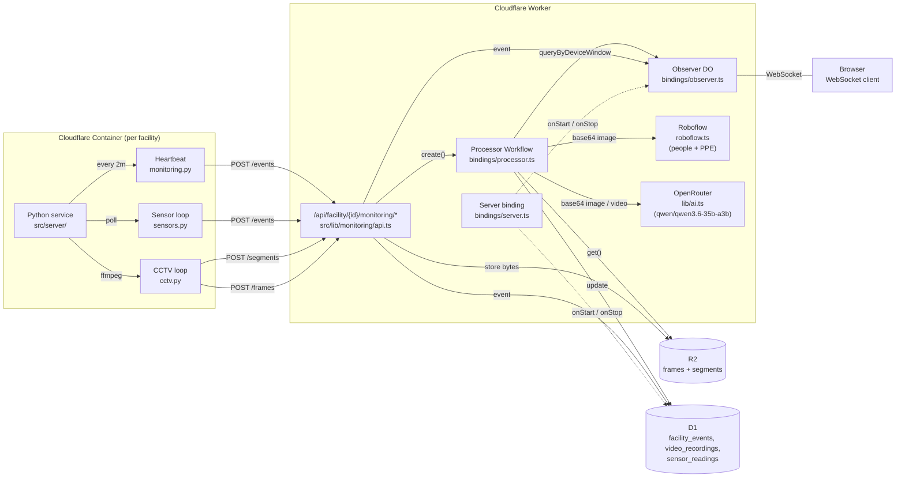
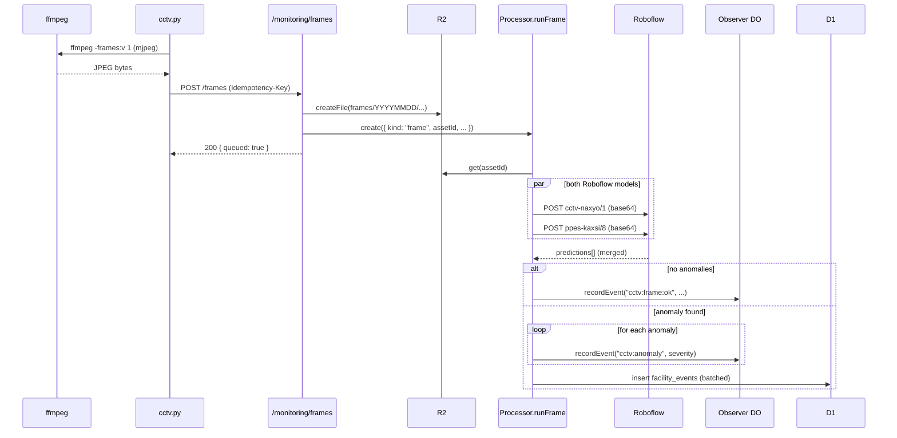
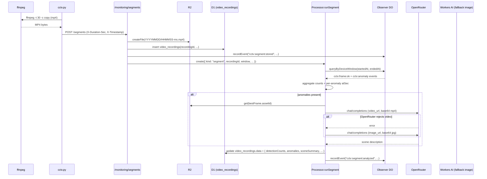
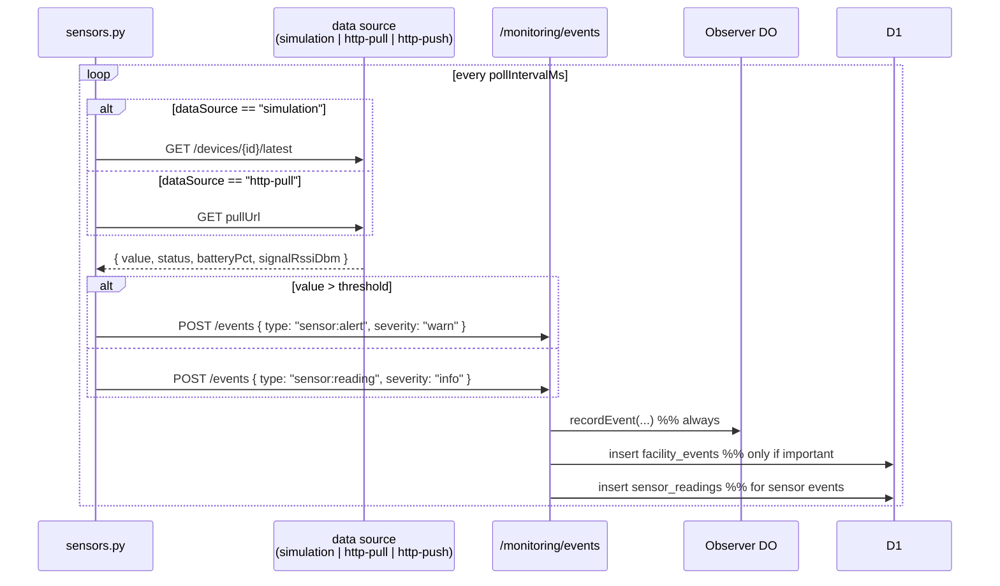

# Facilix Monitoring

How the Python monitoring container (`src/server/`) collects CCTV frames, video
segments, and sensor readings, and how it hands them off to the Cloudflare
Worker bindings in `src/app/src/lib/bindings/`.

## Architecture at a glance



## Python container — `src/server/`

A FastAPI app that runs as a Cloudflare Container, one per facility.

| File | Role |
| --- | --- |
| `main.py` | FastAPI entrypoint. On startup calls `startup_monitoring()`. |
| `config.py` | Env-backed settings (`FACILITY_ID`, `INGEST_TOKEN`, `API_BASE`, sample/segment intervals). |
| `monitoring.py` | Fetches config from the Worker, spawns per-device asyncio tasks + heartbeat. |
| `cctv.py` | One task per camera. Uses **ffmpeg** to sample a JPEG every `FRAME_INTERVAL_SEC` and a 30s MP4 segment every `SEGMENT_INTERVAL_SEC`. |
| `sensors.py` | One task per sensor. Polls `simulation` / `http-pull` (or waits on `http-push`) and posts events when values exceed `threshold`. |
| `api.py` | HTTP client to the Worker: `fetch_config`, `post_event`, `upload_frame`, `upload_segment`. |
| `network.py` | Rewrites `localhost` stream URLs to the Docker gateway; sets ffmpeg `-rtsp_transport tcp`; TCP-probes streams at startup. |
| `utils.py` | Shared `httpx.AsyncClient`, ISO timestamps, logging config. |

Tuning knobs (in `config.py`): frame every **30s**, segment every **60s** (each
segment is **30s** of video), heartbeat every **2min**.

## Worker bindings — `src/app/src/lib/bindings/`

Three objects work together to turn uploads into durable analysis.

### `server.ts` — `Server` (Cloudflare Container)

Wraps the Python container. Has two lifecycle hooks:

- `onStart()` → records `monitoring:started` to the **Observer DO** and **D1**.
- `onStop()`  → records `monitoring:stopped` to both.

It does **not** process frames itself — that is the Worker's job.

### `observer.ts` — `Observer` (Durable Object)

One instance **per facility**, named by facility ID. Backed by SQLite inside
the DO.

- `recordEvent(deviceId, type, data)` — inserts into `observations`, broadcasts
  to all WebSocket clients, schedules a 60s cleanup alarm.
- `queryEvents(...)`, `queryByDeviceWindow(device, from, to, types)` — read
  events. The window query is **oldest-first** so the Processor can replay a
  segment timeline.
- `fetch()` upgrades browsers to a WebSocket and sends an initial snapshot
  (200 most recent events) before streaming new events.
- `alarm()` purges observations older than 24h, then re-arms every hour if any
  rows remain.

### `processor.ts` — `Processor` (Workflow)

Durable workflow triggered by the Worker for every frame and every segment.
Every step runs inside `step.do(...)` with exponential backoff retries.

**Frame branch** (`runFrame`):

1. `load-device-plugins` — read the CCTV device row from D1 and resolve
   the enabled [anomaly plugins](#anomaly-plugins) on it. If a device
   has no enabled plugins, **no Roboflow calls are made** and no anomaly
   events are raised — plugins are the single source of truth.
2. `load-frame` — read JPEG bytes from R2.
3. `detect-objects` — call `detectObjects(bytes, modelRequests)` from
   `monitoring/roboflow.ts`, which runs every Roboflow model required
   by the enabled plugins in parallel and merges the predictions.
4. `match-alerts` — for each detection, look up the matching plugin +
   anomaly option via `findAlertMatch()`. Detections that don't match a
   selected plugin option are ignored (no events).
5. `record-detections` — if no matches → emit a `cctv:frame:ok`
   observation. Otherwise emit one `cctv:anomaly` observation per match
   (severity is `warn` above 70% confidence) including
   `pluginId` / `pluginName` / `optionId` / `optionLabel` in the data,
   **and** batch-insert a `facility_event` row in D1 for every anomaly.

**Segment branch** (`runSegment`):

1. `load-window-detections` — `observer.queryByDeviceWindow(startedAt, endedAt)`
   for the same device, types `cctv:frame:ok` and `cctv:anomaly`.
2. `aggregate` — counts by `pluginName · optionLabel`, picks up to 12
   sample `assetId`s, computes per-anomaly `atSec` offsets, and
   preserves plugin metadata for downstream consumers.
3. `summarize-scene` — when anomalies are present, ask the OpenRouter model
   (`qwen/qwen3.6-35b-a3b`) to describe the segment. We first try to send
   the full MP4 as a `video_url`; if the model rejects the video input we
   fall back to the highest-confidence single frame as an `image_url`.
4. `persist` — writes `{ detectionCounts, anomalies, frameSamples, sceneSummary,
   analyzedAt }` onto `video_recordings.data` and emits a
   `cctv:segment:analyzed` observation (+ D1 row if anomalies present).

## AI providers

### Roboflow — object detection

- File: `src/app/src/lib/monitoring/roboflow.ts`
- Endpoint: `POST {ROBOFLOW_API_BASE}/{project}/{version}` with
  `?api_key=...&confidence=...&format=json&image_type=base64`
  and the base64-encoded JPEG bytes in the body.
- Response is normalised from Roboflow's center-xy box
  (`x, y, width, height`) into a top-left + bottom-right `DetectionBox`.
- `detectObjects(frameBytes, models)` takes the list of Roboflow models
  that should run for a given frame (one per enabled anomaly plugin),
  each with its own confidence threshold. The list is built per-frame
  by the Processor from the CCTV's stored plugin config. When the list
  is empty, no network calls are made.
- Predictions below the per-model confidence threshold are dropped.
- Required env vars:
  - `ROBOFLOW_API_KEY` (secret)
  - `ROBOFLOW_API_BASE` (default `https://serverless.roboflow.com`)
- Legacy env vars (kept for backwards compatibility, currently unused
  by the per-device plugin flow):
  - `ROBOFLOW_PEOPLE_MODEL_ID` (default `cctv-naxyo/1`)
  - `ROBOFLOW_PPE_MODEL_ID` (default `ppes-kaxsi/8`)
  - `ROBOFLOW_CONFIDENCE` (default `0.4`)

If every requested model fails the workflow step throws so `step.do`
retries automatically. If at least one model succeeds, partial results
are kept.

### OpenRouter — scene understanding

- File: `src/app/src/lib/ai.ts`
- Endpoint: `POST https://openrouter.ai/api/v1/chat/completions` with the
  OpenAI-compatible chat completions schema.
- Images are sent as `image_url` data URLs; videos as `video_url` data URLs.
- Env vars:
  - `OPENROUTER_API_KEY` (secret)
  - `OPENROUTER_MODEL` (default `qwen/qwen3.6-35b-a3b`)
  - `OPENROUTER_TITLE`, `OPENROUTER_REFERER` (attribution headers)

The old `createAI()` facade is preserved for backwards compatibility with
other consumers but the monitoring path now uses the typed
`summarizeImage()` / `summarizeVideo()` helpers directly.

## End-to-end flows

### CCTV frame



### CCTV segment



### Sensor



## Event taxonomy

All events flow through the same path: **Observer DO** (always) + **D1
`facility_events`** (only when `shouldPersistToD1` returns true — i.e. anything
that is not a high-volume `monitoring:heartbeat`, `cctv:frame:ok`, or
`sensor:reading`).

| Source | Type | Severity | D1? | Notes |
| --- | --- | --- | --- | --- |
| Container lifecycle | `monitoring:started` / `monitoring:stopped` | info | yes | Recorded by `server.ts` hooks and the container itself. |
| CCTV | `cctv:monitoring:started` | info | yes | One per camera at startup. |
| CCTV | `cctv:frame:ok` | info | no | Emitted by Processor when a frame has no anomalies. |
| CCTV | `cctv:anomaly` | warn / info | yes | One per anomaly (warn above 70% confidence). |
| CCTV | `cctv:segment:stored` | info | yes | Right after a segment is written to R2. |
| CCTV | `cctv:segment:analyzed` | info | yes (if anomalies) | After the Processor aggregates the window. |
| CCTV | `cctv:error` / `cctv:segment:error` | warn | yes | Stream capture failures. |
| Sensor | `sensor:monitoring:started` | info | yes | Per sensor at startup. |
| Sensor | `sensor:reading` | info | no (event), yes (sensor_readings) | Normal value. |
| Sensor | `sensor:alert` | warn | yes (event + sensor_readings) | Value above threshold. |
| Sensor | `sensor:error` | error | yes | Source unreachable. |
| Heartbeat | `monitoring:heartbeat` | info | no | Every 2 minutes. |

## Anomaly plugins

Per-CCTV anomaly detection is configured via **anomaly plugins** stored
on each device's JSON `data.anomalyPlugins` field. Plugins replace the
old hardcoded `ANOMALY_CLASSES` set; they are the single source of
truth for which Roboflow predictions become `cctv:anomaly` events.

- File: `src/app/src/lib/monitoring/anomaly-plugins.ts`
- The catalog (`ANOMALY_PLUGINS`) is curated and currently ships with
  the **PPE Compliance** plugin powered by Roboflow model
  `ppes-kaxsi/8`.
- Per-device config shape:
  ```json
  [
    {
      "pluginId": "ppe-compliance",
      "enabled": true,
      "selectedAnomalies": ["no-safety-vest", "no-mask", "no-gloves"],
      "confidence": 0.4
    }
  ]
  ```
- `normalizeAnomalyPlugins(value)` normalises whatever is in `data`
  into a clean list, dropping unknown plugins or stale option ids.
- `resolveEnabledAnomalyPlugins(configs)` returns the plugins that
  should actually run for a given frame: they must be enabled **and**
  have at least one selected anomaly option.
- `findAlertMatch(resolved, detection)` returns the matching plugin +
  option for a Roboflow prediction, or `null` if the detection isn't
  interesting for the configured plugins.
- Adding a new plugin: append an entry to `ANOMALY_PLUGINS` in
  `anomaly-plugins.ts` with `provider: "roboflow"`, a `modelId`, and
  the user-selectable `options[]`. No code changes are required
  elsewhere — the Processor picks it up automatically.

### PPE Compliance plugin

- Roboflow model: `ppes-kaxsi/8`
- Options:
  - `No Safety Vest` (`no-safety-vest`, `no-safety vest`, `no-vest`)
  - `No Mask` (`no-mask`)
  - `No Gloves` (`no-gloves`)
  - `No Hardhat` (`no-hardhat`, `no-hard-hat`)
  - `No Boots` (`no-boots`)

Users can pick any combination of options per CCTV and tune the
confidence threshold (0–1, default `0.4`). The default for new CCTVs
is `anomalyPlugins: []` — i.e. **no plugins installed, no inference
performed, no anomaly events** — so that cameras only pay Roboflow
costs when an operator explicitly opts in.
